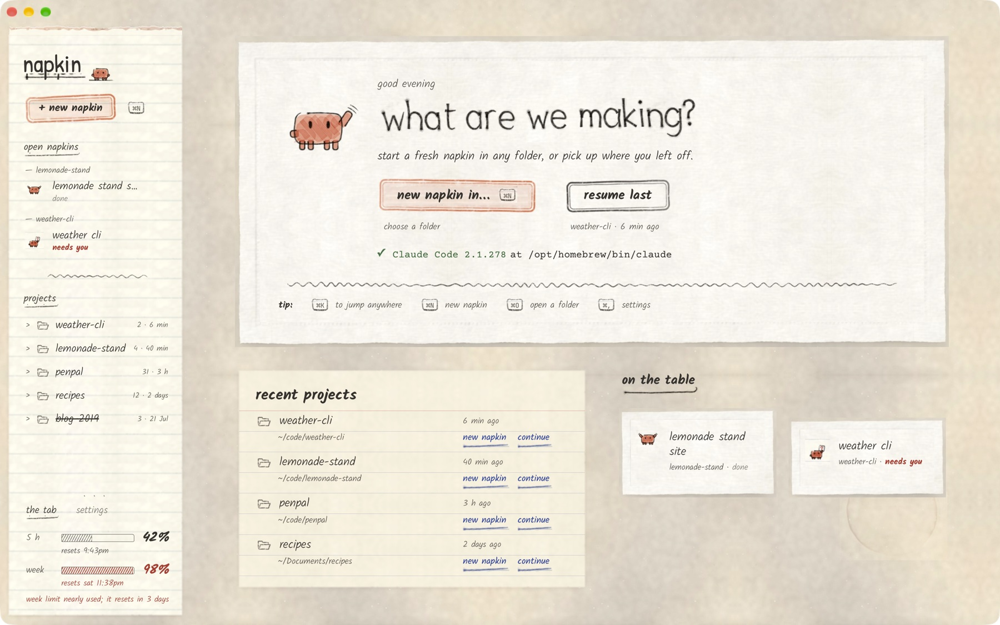
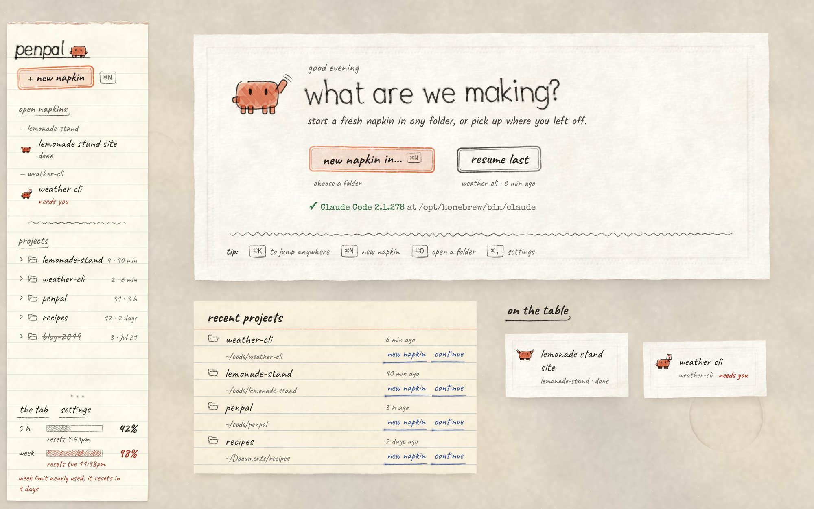
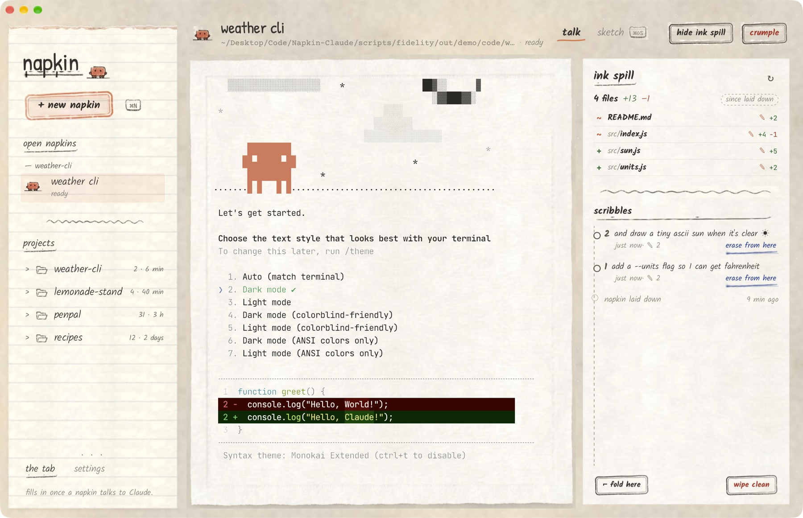
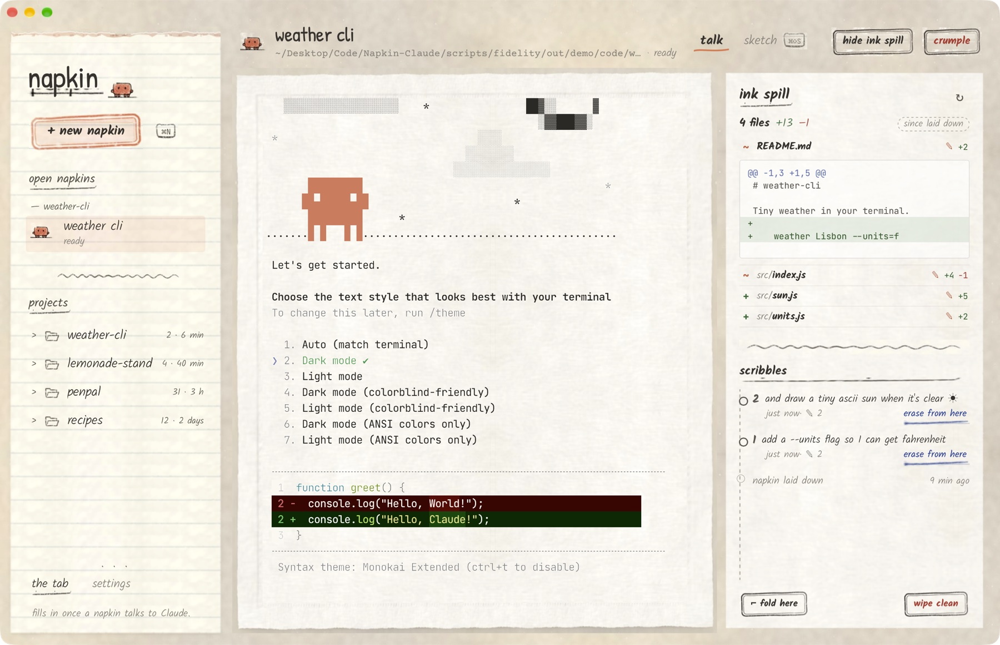
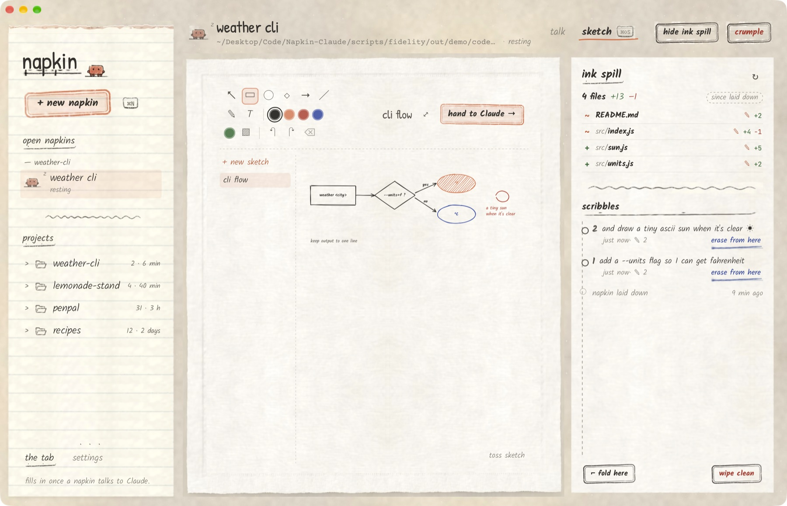
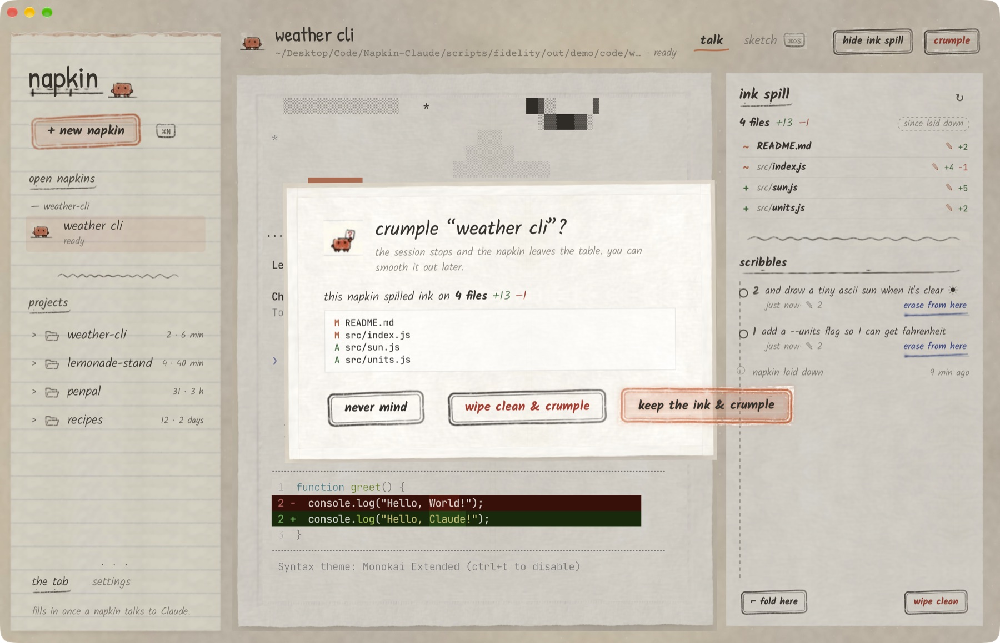
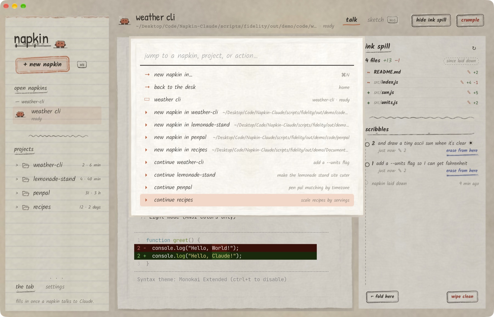

# napkin

**A paper-napkin skin for [Claude Code](https://claude.com/claude-code).** Every session is a
*napkin*: cheap to lay down, easy to inspect, and easy to throw away. The real `claude` CLI runs
inside. Napkin just puts it on paper, shows you what it spilled, and lets you wipe it clean.



> **Credit.** The idea and the look come from **Kevin Ngo's** napkin concept
> ([original post](https://x.com/claudeai/status/2102471874110533750?s=20)). This project is a working build of
> that idea. Its paper, pencil strokes, stains and mascot are sampled directly from the concept image
> ([`docs/reference.png`](docs/reference.png)), and every UI change is checked against it
> ([`docs/DESIGN.md`](docs/DESIGN.md)).
>
> 

## What it does

| | |
|---|---|
| **Talk** | A real Claude Code session in a real PTY (xterm.js, WebGL), on paper. Resume and `--continue` work, and several napkins keep running side by side. |
| **Ink spill** | Every changed file (new / edited / gone) with +/− counts, diffs, and a ✎ on the files Claude edited itself. Updates live as Claude works. |
| **Scribbles & folds** | Each prompt is a *scribble* with a snapshot before and after it. **Erase from here** undoes a scribble's file changes, **fold here** pins a checkpoint, **wipe clean** restores the whole napkin, and every erase can be un-erased. |
| **Crumple** | Close a napkin and either keep the ink or wipe it clean. It's the rollback boundary for a whole session. |
| **Sketch** | A hand-drawn canvas (boxes, circles, decisions, arrows, doodles, notes). Name shapes and draw arrows between them, then **hand to Claude** to save a PNG, an ASCII rendering and a shape spec, with an `@`-reference dropped into the prompt. Claude can draw back onto the napkin too. |
| **The tab** | Your 5-hour and weekly plan usage, read from Claude Code's statusline feed. Your own statusline still shows as before. |

| talk | ink spill |
|---|---|
|  |  |
| **sketch** | **crumple** |
|  |  |
| **⌘K jump anywhere** | |
|  | |

### How the ink spill stays honest

- **Snapshots live in a shadow git repo.** Each project gets its own `GIT_DIR` under
  `~/Library/Application Support/io.github.erscheinung.napkin/shadow/`, and each napkin gets its
  own index. Napkin never touches your `.git`, index, or stash, and your `.gitignore` is respected
  (plus `node_modules`, `target`, … by default).
- **Claude Code hooks are injected only into napkin sessions**, via `claude --settings`. Your settings files are
  never modified. `UserPromptSubmit` snapshots *before* each scribble, and it blocks until the
  snapshot is done, so nothing slips past. `Stop` snapshots *after* it, and `PostToolUse` records
  which files Claude edited.
- **Changes come from the diff, not the hooks**, so edits made through Bash show up too.
- **Tracking turns itself off** for your home folder or for folders with more than 50k files.

## Install

Download the latest build from [**Releases**](https://github.com/Erscheinung/Napkin-Claude/releases/latest):

| Platform | File | Notes |
|---|---|---|
| macOS (Apple silicon + Intel) | `Napkin_<version>_universal.dmg` | Drag Napkin to Applications. |
| Linux (Debian/Ubuntu) | `Napkin_<version>_amd64.deb` | `sudo apt install ./Napkin_<version>_amd64.deb` |
| Linux (any distro) | `Napkin_<version>_amd64.AppImage` | `chmod +x` it, then run it. |
| Windows 10/11 | `Napkin_<version>_x64-setup.exe` | Run the installer. |

Every platform needs [Claude Code](https://docs.anthropic.com/en/docs/claude-code) installed and logged in,
plus git (macOS: `xcode-select --install`; Windows: [Git for Windows](https://git-scm.com/download/win)).

The builds aren't code-signed yet:
- **macOS:** right-click → **Open** the first time, or run `xattr -dr com.apple.quarantine /Applications/Napkin.app`.
- **Windows:** SmartScreen may warn. Choose **More info → Run anyway**.

Linux and Windows builds are produced by CI but haven't been hand-tested yet, so please
[open an issue](https://github.com/Erscheinung/Napkin-Claude/issues) if something looks off.

### macOS (from source)

```bash
git clone https://github.com/Erscheinung/Napkin-Claude.git && cd Napkin-Claude
./scripts/install.sh          # needs Node 20+, Rust, Xcode command line tools
```

This builds `Napkin.app` and copies it to `/Applications`. To get a `.dmg` instead, run `npm ci && npm run bundle`
→ `src-tauri/target/release/bundle/dmg/`.

## Build for Linux and Windows

Napkin is a [Tauri 2](https://tauri.app) app, so it builds on all three platforms. macOS is the primary
target, and CI builds and tests Linux and Windows on every push.

**Linux** (Debian/Ubuntu; for Fedora/Arch, see [Tauri's prerequisites](https://tauri.app/start/prerequisites/)):

```bash
sudo apt install libwebkit2gtk-4.1-dev build-essential curl wget file libxdo-dev libssl-dev \
  libayatana-appindicator3-dev librsvg2-dev git
curl --proto '=https' --tlsv1.2 -sSf https://sh.rustup.rs | sh    # Rust
# Node 20+ from your package manager or nvm
npm ci
npx tauri build --bundles deb,appimage
# → src-tauri/target/release/bundle/{deb,appimage}/
```

**Windows 10/11**:

1. Install the [Microsoft C++ Build Tools](https://visualstudio.microsoft.com/visual-cpp-build-tools/) (the "Desktop development with C++" workload).
2. Install [Rust](https://rustup.rs) (MSVC toolchain), [Node 20+](https://nodejs.org), and [Git for Windows](https://git-scm.com/download/win). Git provides the snapshots, and Claude Code uses Git Bash to run hooks.
3. WebView2 ships with Windows 10/11.

```powershell
npm ci
npx tauri build --bundles nsis
# → src-tauri\target\release\bundle\nsis\Napkin_<version>_x64-setup.exe
```

Tagged releases (`v*`) build all three platforms automatically ([`release.yml`](.github/workflows/release.yml)).

## Use

| | |
|---|---|
| <kbd>⌘N</kbd> / <kbd>⌘O</kbd> | new napkin in a folder (or drop a folder on the desk) |
| <kbd>⌘K</kbd> | jump to any napkin, project, or action |
| <kbd>⌘1</kbd>–<kbd>⌘9</kbd> | switch napkins |
| <kbd>⌘⇧S</kbd> | talk ↔ sketch |
| <kbd>⌘B</kbd> | show/hide the ink spill |
| <kbd>⌘W</kbd> | crumple |
| <kbd>⌘,</kbd> | settings (terminal ink size, let Claude doodle back) |
| <kbd>⇧↩</kbd> | newline in Claude's prompt |

Drop files onto a talking napkin to paste their paths. Claude Code's `/theme` → *Light mode* looks
best on paper.

## Develop

```bash
npm ci
npm run app                  # hot-reloading dev app (vite + cargo)
npm run check                # svelte-check
(cd src-tauri && cargo test) # snapshot / rollback / hook tests
npm run gate                 # visual fidelity gate against docs/reference.png
npm run screens              # regenerate docs/screenshots from a scripted demo
```

Architecture, checkpoints, and design rules live in [PLAN.md](PLAN.md), [CLAUDE.md](CLAUDE.md) and
[docs/DESIGN.md](docs/DESIGN.md). In short: Tauri 2 + Svelte 5 + xterm.js on the front; Rust owns
the PTY, the shadow-git snapshots, the event log, and a `napkin hook` / `napkin statusline`
subcommand of the same binary.

## License

MIT for the code. The concept, the reference image, and the sampled artwork in `src/assets/ref/`
are credited to Kevin Ngo's original napkin design.
